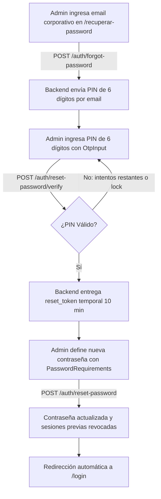
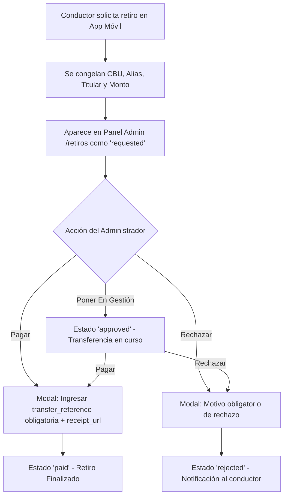

# Transfer Black - Contexto Técnico y Arquitectónico Integral (admin-web)

Este documento centraliza toda la información técnica, reglas de negocio, contratos de API, estructura de carpetas y flujos de usuario del panel web de administración de **Transfer Black**.

---

## 1. 📌 Visión General y Alcance del Sistema

**Transfer Black Admin Web** es la consola de comando y operaciones centralizada para la flota de vehículos ejecutivos y de traslado en Córdoba. La aplicación es utilizada por personal administrativo con perfil `admin` para resolver 5 pilares operativos:

1. **Expedientes y Auditoría de Conductores**: Evaluación de antecedentes, validación documental visual, gestión de entrevistas presenciales y habilitación en la plataforma.
2. **Finanzas y Liquidación de Retiros**: Monitoreo de la cola de pedidos de extracción de dinero de las billeteras de conductores, verificación de datos bancarios congelados y resolución manual (En gestión / Pagado / Rechazado).
3. **Cuentas Corporativas (B2B)**: Administración de empresas clientes, saldos prepagos/postpagos, topes mensuales de gasto, centros de costo y membresías de colaboradores.
4. **Dashboard y Telemetría Operativa**: Monitoreo de KPIs de actividad en tiempo real, facturación, volumen de viajes y cancelaciones.
5. **Seguimiento Público de Viajes (`/track`)**: Visualización en tiempo real del mapa de ruta, conductor y vehículo para pasajeros invitados sin cuenta.

---

## 2. 🏛 Arquitectura del Frontend

El proyecto adopta **Clean Architecture** (Arquitectura Limpia) combinada con una organización screaming por dominios funcionales. Se garantiza el desacople estricto entre la lógica de datos y la interfaz de usuario:

```
src/
├── core/                                # CAPA DE DOMINIO Y ACCESO A DATOS (Agnóstica de React UI)
│   ├── api/
│   │   ├── adminApi.ts                  # Axios con baseURL VITE_API_URL, interceptor JWT e interceptor 401
│   │   └── publicApi.ts                 # Axios público para endpoints de invitados sin autenticación
│   ├── auth/                            # Autenticación, contratos y recuperación de credenciales
│   │   ├── action/                      # auth.actions.ts (login, forgotPassword, verifyResetCode, resetPassword)
│   │   └── interface/                   # auth.interface.ts (UserProfile, AuthTokens, ResetPassword*)
│   ├── companies/                       # Interfaces, schemas Zod y API de empresas corporativas
│   │   └── company.api.ts               # CRUD de empresas, centros de costo, top-ups y miembros
│   ├── dashboard/                       # Contratos y llamadas de métricas (/admin/dashboard/stats)
│   ├── drivers/                         # Dominio de conductores
│   │   ├── actions/                     # getDrivers, getDriverDetail, updateDocumentStatus,
│   │   │                                # scheduleMeeting, rescheduleMeeting, finalizeMeeting,
│   │   │                                # updateApplicationStatus
│   │   ├── interfaces/                  # driver.interface.ts, driver-detail.interface.ts
│   │   └── utils/                       # Formateadores y resolución de URLs de medios
│   ├── payouts/                         # Dominio de retiros bancarios de conductores
│   │   ├── actions/                     # getPayouts, getPayoutById, resolvePayout
│   │   └── interfaces/                  # payout.interface.ts
│   └── tracking/                        # Dominio de seguimiento de viajes
│       ├── actions/                     # getTripTracking.action.ts
│       └── interfaces/                  # trip-tracking.interface.ts
│
├── presentation/                        # CAPA DE PRESENTACIÓN (React, Hooks, Componentes)
│   ├── auth/
│   │   ├── components/                  # OtpInput.tsx (código 6 dígitos con paste), PasswordRequirements.tsx
│   │   └── store/                       # authStorage, useAuthStore (Zustand con persistencia en localStorage)
│   ├── screens/                         # Páginas raíz (Login.tsx, ForgotPasswordScreen.tsx, Dashboard.tsx, TrackTrip.tsx)
│   ├── companies/                       # Módulo Empresas
│   │   ├── components/                  # Balance, consumo, miembros, centros de costo, top-ups
│   │   ├── CompaniesScreen.tsx          # Vista principal (/empresas)
│   │   └── CompanyDetailScreen.tsx      # Ficha detallada (/empresas/:companyId)
│   ├── components/                      # Componentes transversales
│   │   ├── common/                      # Button, Input, Textarea, Badge, Card, AnimatedNumber
│   │   ├── layout/                      # PrivateLayout, Sidebar responsivo/colapsable, Header
│   │   └── ProtectedRoute.tsx           # Guarda de navegación privada
│   ├── dashboard/                       # Módulo Dashboard
│   │   ├── components/                  # ActivityChart (Recharts), KpiCard, DashboardSkeleton
│   │   └── hooks/                       # useDashboardStats
│   ├── drivers/                         # Módulo Conductores
│   │   ├── components/                  # DriversTable, DriverBadge, DocumentCard, RejectionModal
│   │   ├── hooks/                       # useDrivers, useDriverDetail
│   │   ├── DriversScreen.tsx            # Directorio paginado (/conductores)
│   │   └── DriverDetailScreen.tsx       # Expediente (/conductores/:id)
│   ├── payouts/                         # Módulo Finanzas y Retiros
│   │   ├── components/                  # PayoutsTable, PayoutDetailModal, PayoutResolveModal, PayoutsKPIs
│   │   ├── hooks/                       # usePayouts, usePayoutDetail, useResolvePayout
│   │   └── PayoutsScreen.tsx            # Pantalla de retiros (/retiros)
│   ├── tracking/                        # Módulo Seguimiento en Vivo
│   │   ├── components/                  # TripTrackingMap (Leaflet), DriverCard, TripStatusTimeline
│   │   └── hooks/                       # useTripTracking
│   ├── screens/                         # Páginas raíz (Login.tsx, Dashboard.tsx, TrackTrip.tsx)
│   ├── providers/                       # QueryProvider (TanStack Query)
│   └── store/                           # useUIStore (Tema dark/light, estado colapsado de sidebar)
```

---

## 3. 🌐 Endpoints y Contratos de Integración

### A. Módulo de Autenticación y Recuperación de Contraseña (`/auth/*`)

#### 1. Inicio de Sesión
- **URL**: `POST /api/v1/auth/login`
- **Body**: `{ "email": string, "password": string }`
- **Response (200 OK)**:
  ```json
  {
    "data": {
      "profile": { "id": "uuid", "email": "admin@transferblack.com.ar", "roles": ["admin"] },
      "tokens": { "access_token": "jwt...", "refresh_token": "jwt..." }
    }
  }
  ```

#### 2. Solicitud de Recuperación (Forgot Password)
- **URL**: `POST /api/v1/auth/forgot-password`
- **Body**: `{ "email": string }`
- **Response (202 Accepted)**:
  ```json
  {
    "data": {
      "message": "Si el correo está registrado, te enviamos un código."
    }
  }
  ```
  *Nota de seguridad:* Responde 202 con el mismo cuerpo exista o no la cuenta para prevenir ataques de enumeración de usuarios.

#### 3. Verificación de Código PIN
- **URL**: `POST /api/v1/auth/reset-password/verify`
- **Body**: `{ "email": string, "code": string }` (6 dígitos)
- **Response (200 OK)**:
  ```json
  {
    "data": {
      "reset_token": "token-temporal-10min",
      "expires_in": 600
    }
  }
  ```
- **Errores**:
  - `400 VERIFICATION_CODE_INVALID`: PIN erróneo (`details.attempts_remaining` indica intentos restantes).
  - `400 VERIFICATION_CODE_EXPIRED`: El PIN de 15 minutos caducó.
  - `429 VERIFICATION_CODE_LOCKED`: Límite de intentos agotados.

#### 4. Definición de Nueva Contraseña
- **URL**: `POST /api/v1/auth/reset-password`
- **Body**:
  ```json
  {
    "reset_token": "token-temporal-10min",
    "new_password": "Password123"
  }
  ```
- **Reglas de contraseña**: Mínimo 8 caracteres, al menos 1 mayúscula, 1 minúscula y 1 número.
- **Response (200 OK)**:
  ```json
  {
    "data": {
      "message": "Contraseña actualizada."
    }
  }
  ```
  *Efecto colateral:* Revoca todas las sesiones previas del usuario automáticamente.

### B. Módulo de Retiros y Billeteras (`/admin/payouts`)

#### 1. Listado de Solicitudes con Filtros y Paginación
- **URL**: `GET /api/v1/admin/payouts`
- **Query Params**:
  - `status`: `'requested' | 'approved' | 'paid' | 'rejected'` (opcional)
  - `driver_id`: UUID del conductor (opcional)
  - `page`: número (default: 1)
  - `limit`: número (default: 15, máx: 100)
- **Response Shape (200 OK)**:
```json
{
  "data": {
    "payouts": [
      {
        "id": "uuid",
        "driver_id": "uuid",
        "amount": "85000.00",
        "currency": "ARS",
        "status": "requested",
        "payment_method": "CBU",
        "destination_alias": "carlos.chofer",
        "destination_cbu_cvu": "0070000000000000000001",
        "account_holder_name": "Carlos Gomez",
        "account_holder_document": "20-30445566-7",
        "receipt_url": null,
        "requested_at": "2026-10-03T08:15:00.000Z",
        "resolved_at": null,
        "resolved_by_user_id": null,
        "rejection_reason": null,
        "transfer_reference": null
      }
    ],
    "pagination": {
      "page": 1,
      "limit": 15,
      "total": 42,
      "total_pages": 3
    }
  }
}
```

#### 2. Detalle Puntual de Retiro
- **URL**: `GET /api/v1/admin/payouts/:payoutId`
- **Response**: Mismo objeto `data` individual que en el listado.

#### 3. Resolución de Retiro
- **URL**: `PATCH /api/v1/admin/payouts/:payoutId`
- **Casos de Payload**:
  - **En Gestión**:
    ```json
    { "status": "approved" }
    ```
  - **Marcar como Pagado**:
    ```json
    {
      "status": "paid",
      "transfer_reference": "TRANSF-981293",
      "receipt_url": "https://storage.transferblack.com/receipts/proof.pdf"
    }
    ```
    *`transfer_reference` es obligatorio (1-200 car). `receipt_url` es opcional (URL válida max 1000 car).*
  - **Rechazar Solicitud**:
    ```json
    {
      "status": "rejected",
      "rejection_reason": "El CBU no coincide con el CUIT del titular informado"
    }
    ```
    *`rejection_reason` es obligatorio (1-500 car).*

---

### C. Módulo de Conductores y Expedientes (`/admin/applications`)

#### 1. Directorio de Postulantes
- **URL**: `GET /api/v1/admin/applications`
- **Query Params**: `status`, `page`, `limit`, `search`, `order` (`asc` | `desc`)

#### 2. Expediente Completo de Conductor
- **URL**: `GET /api/v1/admin/applications/:id`
- **Response**: Datos de perfil, vehículo, estado de postulación (`pending`, `approved`, `rejected`), lista de documentos con URLs firmadas y reunión agendada si existe.

#### 3. Auditoría de Documentos
- **URL**: `PATCH /api/v1/admin/applications/:id/documents/:documentId`
- **Payload**:
  - Aprobado: `{ "status": "approved" }`
  - Rechazado: `{ "status": "rejected", "rejection_reason": "Foto borrosa" }`

#### 4. Gestión de Entrevistas
- **Agendar**: `POST /api/v1/admin/applications/:id/meeting` `{ "scheduled_at": "ISO-8601" }`
- **Reagendar**: `PATCH /api/v1/admin/applications/:id/meeting/reschedule` `{ "scheduled_at": "ISO-8601" }`
- **Finalizar**: `PATCH /api/v1/admin/applications/:id/meeting/finalize` `{ "status": "completed" | "no_show" | "cancelled", "notes": "..." }`

#### 5. Resolución de Postulación
- **URL**: `PATCH /api/v1/admin/applications/:id/status`
- **Payload**: `{ "status": "approved" | "rejected", "notes": "..." }`

---

### D. Módulo de Empresas Corporativas (`/admin/companies`)

- **Listado y Alta**: `GET /api/v1/admin/companies`, `POST /api/v1/admin/companies`
- **Ficha de Empresa**: `GET /api/v1/admin/companies/:companyId`
- **Recargas de Saldo**: `POST /api/v1/admin/companies/:companyId/top-ups` `{ "amount": number, "reference": string, "notes": string }`
- **Límite Mensual**: `PATCH /api/v1/admin/companies/:companyId/monthly-limit` `{ "limit": number }`
- **Centros de Costo**: `GET` y `POST /api/v1/admin/companies/:companyId/cost-centers`
- **Miembros**: `GET /api/v1/admin/companies/:companyId/members`, `PATCH /api/v1/admin/companies/:companyId/members/:memberId`
- **Cierre de Período**: `POST /api/v1/admin/companies/:companyId/statements/close`

---

### E. Módulo de Dashboard y Métricas (`/admin/dashboard/stats`)

- **URL**: `GET /api/v1/admin/dashboard/stats?periodo=day|month|year&fecha=YYYY-MM-DD`
- **Response**: Totales de facturación, comisiones de plataforma, viajes completados, cancelados y series temporales para el gráfico de barras/líneas.

---

### F. Módulo Público de Seguimiento (`/rides/track/:token`)

- **URL**: `GET /api/v1/rides/track/:token`
- **Headers**: No requiere autenticación.
- **Response**: Telemetría del vehículo (`latitude`, `longitude`, `bearing`), puntos de origen y destino, datos del conductor y estado del viaje.

---

## 4. 💡 Flujos Operativos y Reglas de Negocio

### A. Flujo de Recuperación de Contraseña (Forgot Password)


### B. Flujo de Retiro Bancario


### B. Reglas de Manejo de Datos Bancarios
1. **Inmutabilidad**: Los datos bancarios de una solicitud de retiro reflejan la cuenta al momento del pedido. Aunque el conductor modifique su cuenta después, la transferencia se realiza con los datos congelados del pedido.
2. **Tolerancia a Nulos**: Los campos `destination_cbu_cvu`, `destination_alias`, `account_holder_name` y `account_holder_document` admiten `null` sin arrojar excepciones de runtime (`.slice()` protegido).
3. **Copiado en 1 Clic**: El operador cuenta con botones directos para copiar CBU/CVU o Alias al portapapeles sin seleccionar texto manualmente.

### C. Reglas de Auditoría de Conductores
1. **Secuencia de Aprobación**: No se puede agendar una entrevista presencial si el postulante tiene documentos obligatorios en estado pendiente o rechazado.
2. **Reversibilidad de Auditoría**: Si un documento fue aprobado por error, el admin puede volver a rechazarlo antes de la aprobación definitiva del legajo.

---

## 5. 🎨 Convenciones de Diseño y UX/UI

- **Animación Obligatoria de Números**: Todo contador, saldo o KPI en paneles debe animarse desde 0 (o desde el valor previo) usando `<AnimatedNumber />` con `react-countup`.
- **Soporte Light y Dark Mode**: Ningún color se hardcodea en forma estática. Se utilizan tokens de Tailwind con prefijo `dark:`, clases semánticas (`bg-white dark:bg-dark-surface`, `border-gray-200 dark:border-dark-border`, etc.).
- **Proporciones Fluidas**: Las vistas internas del panel utilizan ancho completo (`w-full`) respetando el padding estándar del layout (`p-4 lg:p-8`), sin límites arbitrarios de `max-w` que dejen márgenes vacíos en pantallas anchas.
- **Idioma del Proyecto**: Toda la interfaz de usuario, etiquetas, mensajes de error y documentación interna se redactan en español neutro o profesional.
